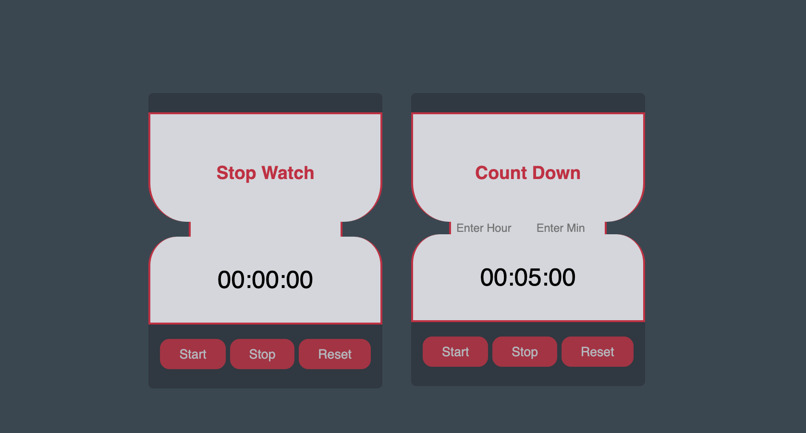

 

 
 
 
<!-- PROJECT LOGO -->
 

   
  

  <h3 align="center">Count-Down App</h3>

  

    An awesome Count-Down App 
     
     
    <a href="https://updown-count.netlify.app/">View Demo</a>
    

---

<!-- ABOUT THE PROJECT -->

## ℹ️ About The Project

 

---

### 🏗️ Built With 
 
<!-- https://dev.to/envoy_/150-badges-for-github-pnk  search skills-->

 
  

 

(<a href="#readme-top">back to top</a>)

